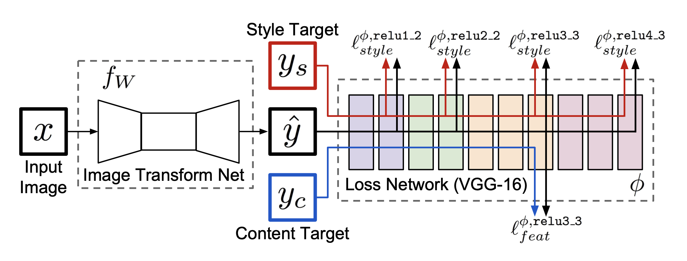
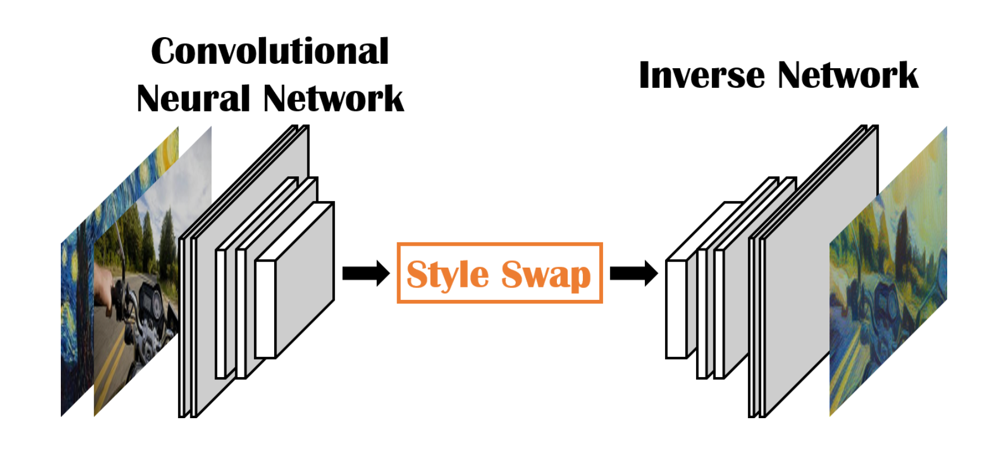
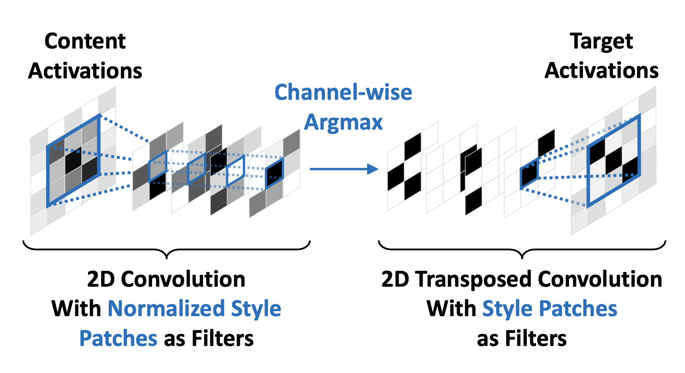

# Image-Style-Transfer

《数字媒体(2)：多媒体》课程中视频小课堂大作业-图像风格迁移任务

## 研究内容

该项目工作主要分为两部分，论文复现以及项目集成。

- 论文复现方面我们主要是对Gatys[[1]](#1)、Johnson[[2]](#2)和Chen[[3]](#3)的工作（考虑到工作量和算力的因素放弃了对于Shen[[4]](#4)
  的方法的复现）进行了完整的复现，从零实现了绝大部分源代码。
- 项目集成方面我们开发了一个图形界面方便我们进行图像风格迁移结果的可视化，以及不同算法的效果对比，同时我们还支持了对于视频的逐帧风格迁移，支持从文件读取和摄像头抓取两种方式，同时会将转换的结果也输出到视频文件中，其中对于摄像头内容的风格迁移速度可以达到23帧每秒，完成了我们"
实时风格迁移"的目标。

## 研究过程

### 数据准备

首先我们进行了数据的准备工作，包括测试内容、测试风格、训练内容、训练风格等，具体选择如下：

- 测试
    - 内容：图片综合各个论文中使用的内容图片再加上一些其他种类的，共计19张，涵盖风景、人物、动物、动画，视频使用了Go Pro宣传片，存放在源码/image/content/目录下
    - 风格：主要为一些艺术作品，共计19张，存放在源码/image/style/目录下
- 训练
    - 内容：MSCOCO 2017 Val + Test 共计45670张
    - 风格：Kaggle竞赛 [Painter by Numbers Test9](https://www.kaggle.com/c/painter-by-numbers) 共计8491张

在对图片尺寸的要求上，Gatys的方法只需要限制内容和风格图片尺寸一样（计算loss需要），Johnson的方法训练的时候需要保证内容和风格图片尺寸一样（同Gatys），测试时对内容和风格图片则没有限制，Chen的方法同Johnson方法类似（训练时保证尺寸固定是为了保证训练集图片的一致性，测试时则对图片大小不做限制）。

考虑到以上限制，以及为了保证效率和UI的一致性，在训练和测试时，我们将所有的输入图片都裁剪为了256x256大小，方法为先根据长宽来切成正方形（其中宽的图片选中间，长的图片选上边，因为这类图片一般是人像，人脸通常在靠上方），然后再缩放到256变长；开发图形界面中，输入输出也均限制为256x256，虽然不够高清，但迁移的效果已足够明显，在该像素上进行算法效果对比也已足够。

### Gatys方法复现

原理不再赘述，我们使用PyTorch重新实现了整个算法。部分设置如下：

- 利用vgg19作为特征提取模型
- Conv4\_2作为内容
- Conv1\_1, Conv2\_1, Conv3\_1, Conv4\_1, Conv5\_1作为风格
- 1500次迭代

其中内容层和风格层的选择对齐了原论文。1500次迭代在单GTX1060显卡下耗时4分钟。 部分迁移结果见测试结果/Gays目录。

### Johnson方法复现

Johnson方法是对Gatys方法的改进，其将Style固定之后用大量不同的内容图片泛化一个网络。再来一张内容图片的时候只需一次前向传播就能产生该图片的迁移结果，大大提升了算法的运行速度，使固定风格实时风格迁移成为可能。Johnson方法的网络示意图如下：

其中左侧的Image Transform
Net不是我们关注的重点，所以对于这部分我们直接使用了[别人的开源实现](https://github.com/dxyang/StyleTransfer/blob/master/network.py)
，其余部分我们自己重新实现。右边没有按照该图上面来，我们沿用了我们所实现的Gatys中使用的特征提取模块进行相关loss的计算。在训练中batchsize取了4，迭代10000次，每次迭代随机选取一张内容和风格进行训练。

最终训练一张风格的图片需要1.5小时，生成固定风格的内容迁移结果只需90毫秒（包含文件的读写）。我们对于测试的19张图片都提供了训练好的模型，放在源码/algorithms/Johnson/model目录下，在我们开发的demo中无需进行其他设置即可直接使用。
部分迁移结果见测试结果/Johnson目录。

### Chen方法复现

Chen的方法与上述两种不太一样，其提出了一种Style Swap操作，整体框架如下：

其思路是先用特征提取网络提取出内容和风格图片的高级特征表示，然后将两者均划分成patch表示（例如3x3的），然后对于内容的每一个patch，选取在风格中的所有patch中与它最相似的并替换，然后将结果用一个逆网络从高级特征表示再转换回RGB通道表示。这一步作者巧妙地将风格的patch表示为一个个卷积核的参数从而实现了高效的Style
Swap操作，使得其形成一个完整的可训练的网络。Style-Swap操作的实现如下：

作者实现的代码为Lua版本，我们参考了[Github上的PyTorch版本复现](https://github.com/irasin/Pytorch_Style_Swap) 重新实现了完整的代码，并大量复用了前面已做工作中提供的方法。

在训练时因为显存不够，我们不得不将BatchSize设为1以及去掉了Instance Normalization层（实际上不应该去），迭代60000次，每次随机一张内容和风格进行训练。

训练花费4小时，测试任意风格任意内风格迁移仅需150毫秒（包含文件读写），生成的模型位于源码/algorithms/Chen/model.pt。

部分迁移结果见测试结果/Chen目录。

### Demo开发

我们使用了PyQT5来开发图形界面，工程化的东西不再赘述。

在开发demo的过程中，我们首先将复现工作中的接口统一为（内容图片路径、风格图片路径、目标图片路径），方便我们的前端进行资源的准备，同时做了一些准备工作，让模型更快地加载。这一步已经可以较好地完成图像迁移的部分。

在视频迁移的部分我们用OpenCV来读取视频帧/摄像头帧，并存到指定路径处，再调用迁移算法同时将结果显示到屏幕上同时再后台写入到成品视频，实现之后发现速度较慢，离我们的想实现实时效果还有一定距离。于是我们更改了之前接口，不再将获取到的帧存到文件，直接根据算法转化为模型需要的图片格式，多了一点代码量，但是省去了大量的文件读写操作，效率得到了巨大提升。效果对比如下：

|      | 摄像头(640 x 480) | 1280 x 720 | 1920 x 1080 |
| ---- |----------------|------------|-------------|
| 原本 | 110ms          | 274ms      | 354ms       |
| 优化 | 44ms           | 165ms      | 273ms       |

## 结果分析

从实验对比的结果中看出

- Chen的方法整体色调都偏暗，某些结果完全有一种褪色的感觉，推测是因为我们修改了BatchSize以及去掉了IN层的原因
- Johnson的方法效果较淡，某些结果像是内容图基本没变，在上面盖了一层滤镜，推测可能是因为内容loss和风格loss的权重选取没有到最合适的地方，每张风格不同，其超参也应当有明显区别，然而我们训练时为了方便所有风格选取了一套参数来进行流水线式的训练
- Gatys的方法所耗时间较长，也比较符合风格迁移最原本给人的效果，但因为分辨率较低，很多内容看不清楚，增大分辨率会在提升效果的同时也会使得迁移时间成倍增长

## 参考文献
<a id="1">[1]</a>
Gatys, L.A., Ecker, A.S., Bethge, M.: A neural algorithm of artistic style. arXiv preprint arXiv:1508.06576 (2015)

<a id="2">[2]</a>
Johnson J , Alahi A , Fei-Fei L . Perceptual Losses for Real-Time Style Transfer and Super-Resolution[J]. 2016.

<a id="3">[3]</a>
T. Q. Chen and M. Schmidt. Fast patch-based style transfer of arbitrary style. arXiv preprint arXiv:
1612.04337,2016.

<a id="4">[4]</a>
Shen F , Yan S , Zeng G . Meta Networks for Neural Style Transfer[J]. 2017.

<a id="5">[5]</a>
Radford, A., Metz, L., Chintala, S.: Unsupervised representation learning with deep convolutional generative adversarial
networks. In: ICLR. (2016)